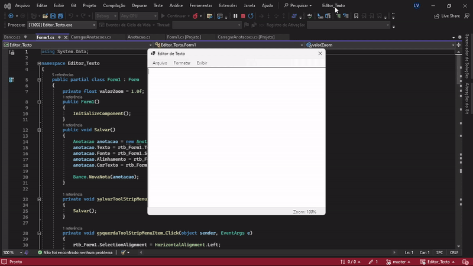
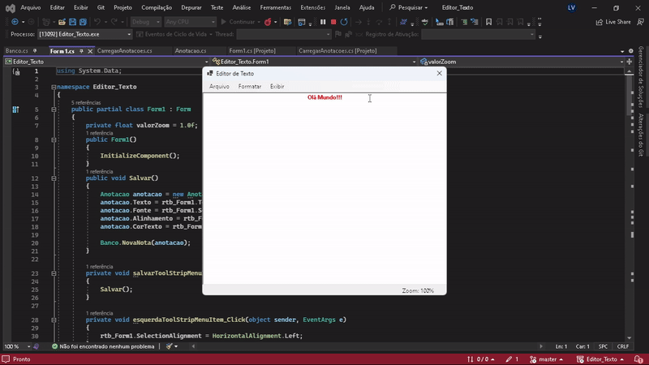

# Projeto Editor de Texto: C# e SQLite

Esse software de Editor de Texto foi feito no Visual Studio no Windows Forms na linguagem C#. Utilizei o SQLite para criar o banco de dados.

  

É um software que permite ao usuário personalizar os textos alterando o alinhamento (esquerda, centro e direita), o estilo da fonte (negrito, itálico e sublinhado) 
e a cor do texto. 

  

Outra funcionalidade é o zoom. É possível aumentar ou diminuir o zoom para deixar o texto melhor a leitura.

  

Quanto aos textos que o usuário salvou e quiser recuperá-los, basta clicar em 'Arquivo' e em seguida 'Abrir...'. Onde um novo formulário aparecerá com novas informações.

  

Nesse Data Grid View é possível verificar todos os textos que o usuário salvou, mostrando o ID, alinhamento, fonte e a cor do texto. Logo abaixo desse campo, os três botões
permitem manipular as informações acima.

  

'Selecionar' transfere o texto de volta ao primeiro 'forms', 'Excluir' deleta permanentemente o texto (por isso, cuidado) e o botão 'Fechar', fecha esse 'forms', trazendo o
usuário de volta ao anterior.
